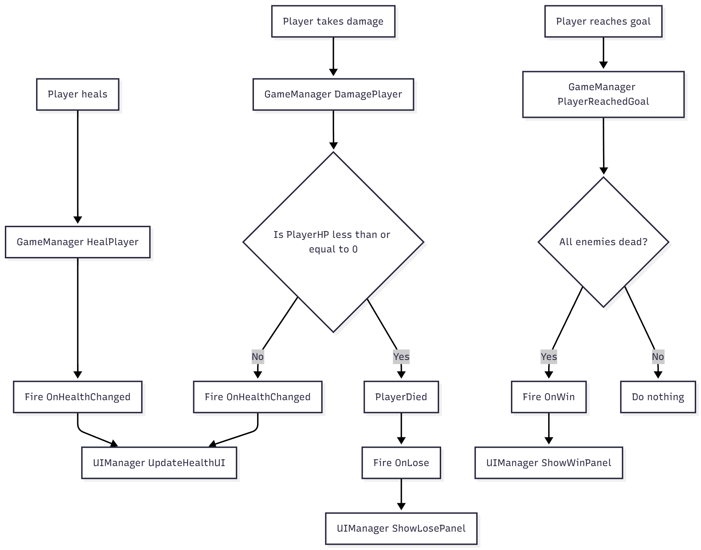
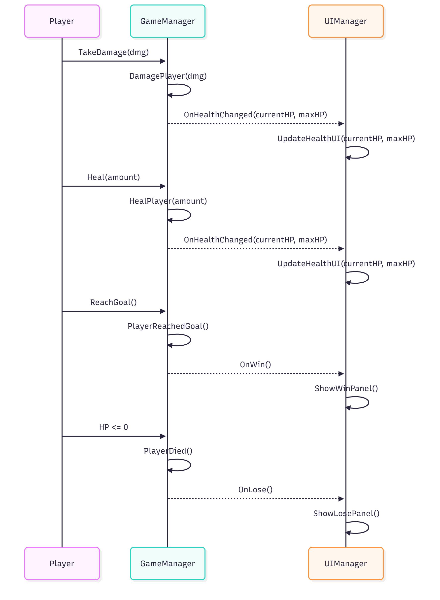

# Prison break 

### Description

The controls are A and D for movement, Space For jump, LeftControl to shoot, and LeftAlt/S to stomp. 
The goal of the game is to avoid the damaging spikes kill all the guards/enemies and reach the end goal when all guards are dead. 
There are also health packs in the game that can heal the player but they can also be shot, I added this as a last second thought to stop the players from just spamming their gun. 
I decided to use the game I made for lab 2 since I already had events firing for win and lose and decided to expand on some of the functionality and some polish as well as add a UI for the observer pattern.
### 1. What element of your game adopts the chosen pattern?
---
My UImanager is an observer that subscribes to the events fired by my game manager, such as loss, win, and health change. I have a very simple health bar that is updated every time the "OnHealthChange" event is fired by the game manager
There is also a "win" panel and a "lose" panel that are each set to activate when the corresponding event is fired. 

### 2. Why is this pattern a good choice for spawning these objects?
---
The Observer pattern lets UIManager automatically react to GameManager events (health changes, win, lose) without constantly checking the game state. It keeps the UI decoupled and easy to extend and change.

## UML Diagram
### Activity Diagram

### Sequence Diagram

